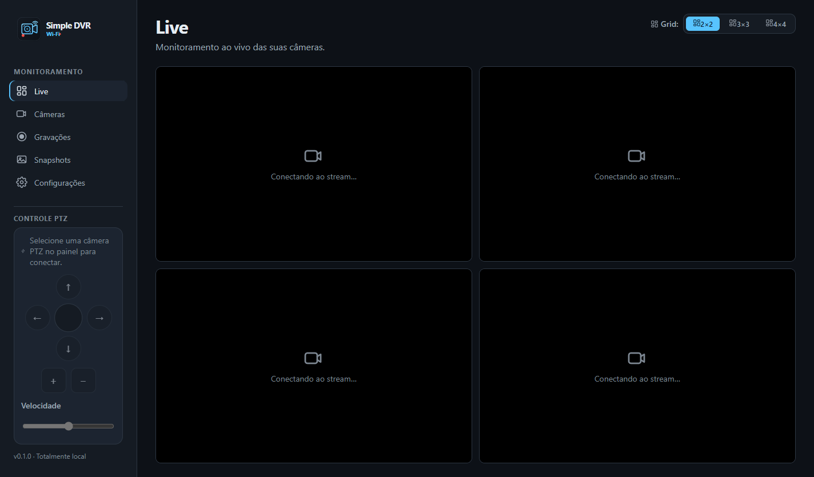

<p align="center">
  
</p>

<p align="center">Monitoramento local de câmeras IP e Wi-Fi no Windows.</p>

Simple DVR Wi-Fi é um aplicativo desktop para cadastrar câmeras ONVIF/RTSP,
assistir ao vídeo ao vivo, controlar PTZ quando disponível, capturar snapshots e
gravar localmente. Ele opera na rede local: não envia telemetria nem exige uma
conta em nuvem.

> Status: MVP em desenvolvimento. Consulte o [changelog](CHANGELOG.md) para as
> mudanças entregues e as limitações conhecidas antes de usar em produção.

## Recursos

- Cadastro manual com presets de fabricante/modelo que geram a URL RTSP a partir
  do endereço, porta, canal e perfil escolhidos.
- Configuração manual de URL RTSP e ONVIF, com teste de conexão antes de salvar.
- Vídeo ao vivo em grades 2×2, 3×3 e 4×4, tela cheia e seleção de stream
  principal ou secundário.
- Organização persistida da grade, snapshots e gravação local segmentada.
- Descoberta e uso de capacidades ONVIF, incluindo PTZ quando a câmera oferece
  o recurso.
- Biblioteca local para reproduzir gravações e consultar snapshots.
- Dados em SQLite, migrações com backup prévio e credenciais cifradas no
  computador do usuário.

## Telas

<p align="center">
  
</p>

<p align="center"><em>Monitoramento ao vivo com quatro câmeras em grade 2×2.</em></p>

## Requisitos

- Windows 10 ou 11, arquitetura x64.
- 4 GB de RAM ou mais; a demanda cresce com o número, resolução e codec dos
  streams.
- Espaço em disco suficiente para a retenção desejada de snapshots e gravações.
- Câmeras acessíveis pela rede local, com RTSP e/ou ONVIF configurados.

O projeto exige Node.js `>=22 <26` e npm somente para desenvolvimento.

## Começar a monitorar

1. Abra **Câmeras** e escolha **Adicionar manualmente**.
2. Informe nome, endereço e credenciais da câmera.
3. Selecione o modelo ou família quando disponível. O aplicativo monta a URL
   RTSP automaticamente; ajuste canal, stream ou URL se o firmware exigir.
4. Clique em **Testar conexão** e confirme o cadastro quando a comunicação for
   validada.
5. Em **Live**, organize as câmeras na grade e use os controles para tela cheia,
   snapshot ou gravação.

Os presets aceleram a configuração, mas não substituem a validação. Endpoints
RTSP podem variar conforme modelo, OEM, firmware e região. As credenciais são
salvas separadamente da URL; evite inseri-las diretamente no endereço RTSP.

### Fabricantes e famílias predefinidos

Os presets atuais cobrem famílias Intelbras e Mibo, TP-Link Tapo, Hikvision,
Dahua, Axis, Foscam, Vivotek, Hanwha/Samsung Techwin, Luxvision, Tecvoz, D-Link,
GeoVision, LG, Multilaser, Ubiquiti, Zavio, YooSee, Haiz e Greatek. Para um
modelo não listado, selecione **Outro modelo / URL manual**.

## Limitações conhecidas

- Compatibilidade de RTSP, ONVIF, codecs e PTZ depende do equipamento e do
  firmware; o teste de conexão é necessário para cada instalação.
- O substream depende de a câmera expor um perfil secundário. Caso contrário, o
  aplicativo usa o stream principal.
- A aceleração de hardware é habilitada por padrão. Se o driver ou codec não for
  compatível, o Chromium usa decodificação por software. Alterações nessa opção
  exigem reiniciar o aplicativo.
- Ao minimizar a janela, os players ao vivo são suspensos para reduzir consumo;
  gravações em andamento continuam.
- O aplicativo reproduz somente vídeo. O áudio dos streams não é negociado nem
  decodificado.
- O fallback de snapshot por RTSP requer um `ffmpeg` acessível no `PATH`.
  FFmpeg ainda não é redistribuído com o aplicativo.

## Desenvolvimento

```bash
npm ci
npm run rebuild:native
npm run dev
```

Os ícones de janela e instalação são gerados automaticamente a partir de
`docs/logo/` antes de iniciar ou criar um build.

### Verificação

| Comando                              | Finalidade                                                                                |
| ------------------------------------ | ----------------------------------------------------------------------------------------- |
| `npm run typecheck`                  | Verifica os tipos dos processos principal, preload e renderer.                            |
| `npm run lint`                       | Executa as regras de qualidade do código.                                                 |
| `npm test`                           | Executa regressões de SQLite, RTSP, snapshots, gravações, segurança e presets.            |
| `npm run test:player`                | Exercita o ciclo de vida do player ao vivo.                                               |
| `node scripts/camera-form-smoke.mjs` | Valida o formulário de câmera e seus presets em uma janela Electron isolada.              |
| `node scripts/settings-smoke.mjs`    | Valida os fluxos e o layout de configurações.                                             |
| `npm run test:all`                   | Executa a suíte local completa, incluindo build, testes, PTZ e verificações de segurança. |

Os testes automatizados usam simuladores, servidores locais e diretórios
temporários. Eles não substituem o teste com as câmeras e firmwares que serão
usados na operação.

## Empacotamento

```bash
npm run rebuild:native
npm run build:win
```

O instalador Windows é criado em
`dist/Simple DVR Wi-Fi-<versão>-setup.exe`. O processo inclui o ícone do
aplicativo, reconstrói o SQLite para a ABI do Electron e valida os binários de
mídia incluídos.

| Comando                   | Finalidade                                                 |
| ------------------------- | ---------------------------------------------------------- |
| `npm run verify:binaries` | Confere a presença e o hash dos binários de mídia.         |
| `npm run release:gate`    | Bloqueia releases com componentes sem aprovação.           |
| `npm run release:assets`  | Gera SBOM, licenças, NOTICE e fontes de binários.          |
| `npm run smoke:package`   | Faz smoke test de um pacote Windows usando `PACKAGED_EXE`. |

Detalhes sobre MediaMTX, FFmpeg e suas licenças estão em
[resources/README.md](resources/README.md).

## Arquitetura e segurança

```text
src/
├── main/       janela, IPC validado, serviços e supervisores
├── preload/    API mínima exposta ao renderer por contextBridge
├── renderer/   interface React e estado de apresentação
├── shared/     contratos, schemas e tipos compartilhados
└── workers/    SQLite, ONVIF, RTSP, MediaMTX e FFmpeg
```

- O renderer roda em sandbox, com `contextIsolation`, `nodeIntegration: false`,
  CSP restritiva e sem acesso direto ao sistema operacional.
- O preload expõe apenas operações específicas e validadas; ele não expõe
  `ipcRenderer`.
- As credenciais são cifradas com AES-256-GCM e a chave é protegida pelo
  `safeStorage` do sistema.
- MediaMTX é executado por sessão local, limitado a loopback e validado por hash
  antes de iniciar.
- FFmpeg é chamado sem shell, com argumentos e caminhos validados.

## Documentação

- [Changelog](CHANGELOG.md)
- [Especificações e mudanças OpenSpec](openspec/)
- [Política de binários de mídia](resources/README.md)

## Licença

Distribuído sob a [Licença MIT](LICENSE).
