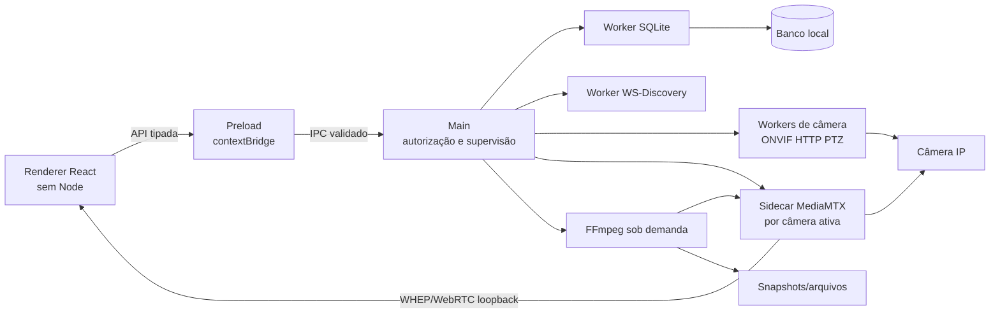

## Context

O repositório contém somente a documentação funcional e a configuração OpenSpec; não há aplicação ou dados legados. A motivação e o recorte do MVP estão em `proposal.md`, e os contratos observáveis estão nas nove specs desta mudança.

O desenho precisa conciliar quatro restrições centrais: o Chromium não reproduz RTSP diretamente de forma portável; câmeras e respostas ONVIF são entradas não confiáveis; até 16 streams simultâneos não podem bloquear o processo principal; e credenciais recuperáveis precisam permanecer cifradas com uma chave que não esteja ao lado do banco. A primeira entrega é para Windows, preservando fronteiras que permitam futura porta para Linux.

## Goals / Non-Goals

**Goals:**

- Estabelecer limites de processo que mantenham renderer sem privilégios e isolem rede e mídia do ciclo de vida da janela.
- Definir um caminho de mídia de baixa latência que reutilize o stream original sempre que possível e aceite fallback controlado por capacidade.
- Tornar persistência, criptografia, IPC, logs e execução de binários seguros por padrão.
- Permitir entrega vertical incremental, testes sem hardware e substituição futura de adaptadores de câmera ou mídia.
- Entregar um pacote Windows autossuficiente, preservando decisões que viabilizem uma futura porta para Linux.

**Non-Goals:**

- Criar servidor remoto, conta de usuário, sincronização em nuvem ou API acessível pela LAN.
- Expor MediaMTX, FFmpeg, SQLite ou detalhes ONVIF diretamente ao renderer.
- Construir uma plataforma genérica de plugins no MVP; extensibilidade será obtida por portas internas estreitas.
- Garantir H.265 em toda combinação de Electron, sistema operacional e hardware.
- Implementar eventos ONVIF, detecção de movimento, IA, NVR/NAS ou retenção automática.

## Decisions

### 1. Stack e organização do projeto

A aplicação será criada a partir do template React + TypeScript do `electron-vite`, usando ESM, TypeScript estrito, duas configurações de tipos (Node e DOM), React no renderer, Zustand apenas para estado de apresentação e `electron-builder` para os pacotes. A versão do Node embarcada pelo Electron será o alvo efetivo e será fixada junto com Electron e o lockfile.

A estrutura seguirá limites por responsabilidade:

```text
src/
├── main/                 # ciclo de vida, janelas, autorização IPC e supervisão
│   ├── ipc/
│   ├── security/
│   └── supervisors/
├── preload/              # API estreita exposta via contextBridge
├── renderer/             # React, páginas, componentes e stores efêmeros
├── workers/
│   ├── database/         # SQLite e migrações
│   ├── discovery/        # WS-Discovery por interface
│   └── camera/           # ONVIF/HTTP/PTZ e testes de conexão
└── shared/               # contratos, schemas, estados e erros tipados
resources/
├── mediamtx/<platform>/
└── ffmpeg/<platform>/
```

O main será o composition root. Casos de uso dependerão de interfaces de repositório, vault, ONVIF e mídia, não de singletons globais. Erros operacionais terão códigos tipados; erros inesperados encerrarão apenas o worker afetado, que será reiniciado pelo supervisor.

Alternativas consideradas: um único processo Node concentraria menos código de coordenação, mas qualquer parser, consulta síncrona ou dispositivo lento poderia congelar toda a UI; uma aplicação web local adicionaria uma superfície de rede desnecessária.

### 2. Fronteiras de processo e fluxo de dados



O renderer só conhece operações de domínio como `cameras:list`, `discovery:start`, `stream:acquire`, `ptz:start`, `ptz:stop` e `recording:set`. O preload não expõe `ipcRenderer`, canais arbitrários, caminhos livres nem eventos Electron. Cada handler valida payload, sender e estado de autorização antes de delegar.

Operações de banco, descoberta e protocolos rodam em `utilityProcess` ou workers equivalentes, com limites de concorrência e cancelamento. A API oficial de [`utilityProcess`](https://www.electronjs.org/docs/latest/api/utility-process) permite processos Node supervisionáveis e troca por MessagePort. MediaMTX e FFmpeg são binários externos iniciados diretamente com array de argumentos; nenhum valor de câmera ou usuário passa por shell.

Alternativas consideradas: worker threads compartilham o processo e oferecem isolamento de falha inferior; preload com módulos nativos exigiria relaxar sandbox; IPC genérico reduziria arquivos de contrato, mas recriaria uma ponte privilegiada insegura.

### 3. Baseline de segurança Electron

Toda janela usará `sandbox: true`, `contextIsolation: true`, `nodeIntegration: false` e `webSecurity: true`. O app chamará `app.enableSandbox()` antes de `ready`, carregará o renderer empacotado por protocolo `app://` privilegiado e seguro, negará navegação e novas janelas não autorizadas e abrirá links externos somente após validação estrita. A CSP permitirá scripts e estilos empacotados e apenas as conexões loopback necessárias ao player.

Essas escolhas seguem o checklist oficial de [segurança do Electron](https://www.electronjs.org/docs/latest/tutorial/security), que recomenda sandbox, isolamento de contexto, CSP, validação do sender IPC e bloqueio de navegação. Conteúdo retornado por câmeras nunca será injetado como HTML.

Schemas compartilhados validarão todos os limites: IPC, dados persistidos, importações, respostas ONVIF, URLs, portas, paths, velocidades PTZ e eventos de sidecars. XML será analisado com DTD e entidades externas desabilitados, tamanho e profundidade limitados e timeout/cancelamento. Exceções HTTPS serão registradas por câmera e fingerprint; não haverá bypass global de TLS.

### 4. Persistência e criptografia de credenciais

SQLite será o armazenamento autoritativo, acessado exclusivamente pelo worker de banco por mensagens assíncronas. Um driver SQLite embutido e mantido será selecionado no início da implementação e reconstruído para a ABI do Electron quando nativo. Migrações serão numeradas, transacionais e acompanhadas por backup consistente antes de mudanças destrutivas.

O modelo inicial separará:

- `cameras`, endpoints e identidade estável;
- `camera_profiles` e `camera_capabilities` atualizáveis;
- `camera_credentials` por serviço, contendo somente ciphertext, nonce, tag e versão da chave;
- `recordings` e segmentos, com estados e timestamps UTC;
- `snapshots`, preferências e histórico diagnóstico limitado.

No primeiro armazenamento de segredo, o main gerará uma chave aleatória de 256 bits. Essa chave será envolvida pelo `safeStorage` do Electron; cada credencial será cifrada separadamente com AES-256-GCM e nonce aleatório único. O banco recebe somente o envelope cifrado. Para uma operação de câmera, o main desenvelopa a chave, descriptografa apenas o segredo requerido e o entrega ao worker específico pela mensagem de trabalho, nunca ao renderer.

No Windows, o aplicativo verificará a disponibilidade de `safeStorage` e falhará de forma fechada para persistência de credenciais quando ela não existir. Não haverá fallback com chave fixa. Uma futura porta para Linux deverá também recusar o backend `basic_text` descrito pela [documentação oficial](https://www.electronjs.org/docs/latest/api/safe-storage), mas secret stores Linux não entram na entrega atual.

Alternativas consideradas: cifrar diretamente cada senha com `safeStorage` dificulta rotação e teste de integridade uniforme; banco SQLCipher adiciona distribuição nativa e ainda exige proteger sua chave; arquivo JSON não oferece consultas, migrações e transações adequadas.

### 5. Descoberta, onboarding e ONVIF

O worker de descoberta enumerará interfaces elegíveis, enviará WS-Discovery separadamente por interface e reunirá respostas por endpoint reference, XAddr e identidade. Cada execução terá `AbortController`, timeout global, progresso incremental e cancelamento. VPNs e interfaces virtuais serão identificáveis, e o usuário poderá restringir o escopo.

O onboarding será uma orquestração tolerante a falhas: alcance/DNS, autenticação, Device Management, Media/Media2, profiles, snapshot, PTZ e probe RTSP produzem resultados independentes. `Promise.allSettled` será usado somente para verificações realmente independentes, com limite de concorrência; uma falha não apagará sucessos anteriores.

Uma porta `CameraAdapter` normalizará identidade, capacidades, perfis, PTZ e snapshot. A primeira implementação será ONVIF genérica, com RTSP/HTTP manual como fallback. Respostas incompletas são convertidas em `supported`, `unsupported`, `unknown` ou `error`, evitando booleanos otimistas. Integrações proprietárias futuras poderão implementar a mesma porta sem contaminar o domínio.

### 6. Pipeline de mídia

Cada câmera ativa terá um `MediaSession` supervisionado. A implementação inicial iniciará um sidecar [MediaMTX](https://mediamtx.org/docs/kickoff/introduction) isolado por câmera, ligado apenas a `127.0.0.1`, com portas efêmeras, autenticação aleatória por sessão, API de controle inacessível ao renderer e diretório de configuração temporário com permissões restritas. Main stream e substream serão paths do mesmo sidecar; consumidores iguais compartilham o path e um contador de referências decide quando encerrá-lo.

MediaMTX puxará RTSP e exporá WHEP/WebRTC ao player React. A documentação oficial confirma leitura por [WebRTC/WHEP em browsers](https://mediamtx.org/docs/read/webrtc) e que o binário é multiplataforma e sem dependências. WebRTC foi escolhido como transporte interno por baixa latência; não constitui o recurso remoto WebRTC listado como futuro, pois todos os listeners permanecem no loopback.

O caminho de codec será:

1. encaminhar H.264 compatível sem decodificar;
2. remux quando o contêiner/transporte exigir;
3. usar FFmpeg sob demanda para H.265/MJPEG ou áudio incompatível somente quando o probe do player e a política de recursos indicarem necessidade;
4. declarar `codec_incompatible` quando nenhum fallback licenciado e suportado estiver disponível.

FFmpeg também fará captura de frame quando não houver Snapshot URI. Cada execução terá argumentos fixos e valores validados, stdout/stderr limitados, timeout, diretório permitido e encerramento supervisionado. A distribuição usará build cuja configuração e licença tenham sido auditadas; o próprio projeto alerta que opções GPL alteram as obrigações de [licenciamento do FFmpeg](https://ffmpeg.org/legal.html).

Alternativas consideradas: HLS aumenta latência e exige player adicional; frames decodificados por IPC aumentam CPU, memória e cópias; RTSP direto no `<video>` não é portável; um gateway compartilhado reduz processos, mas amplia o raio de falha. Um sidecar por câmera custa mais memória, porém cumpre isolamento e ainda compartilha consumidores dentro da câmera. Esse custo será medido nos layouts 9 e 16 antes de estabilizar a versão.

### 7. Gravação e snapshots

Gravação manual habilitará segmentos fMP4 no MediaSession, preferindo cópia do stream. O [modelo de gravação do MediaMTX](https://mediamtx.org/docs/references/configuration-file) permite partes curtas e limita o RPO à duração da última parte; o MVP adotará partes de aproximadamente um segundo e segmentos com duração controlada, sem exclusão automática. O banco agrupará segmentos em uma sessão lógica e registrará `starting`, `recording`, `stopping`, `completed`, `interrupted` ou `failed`.

Parar ou encerrar o aplicativo pedirá flush do sidecar, aguardará confirmação até um timeout e catalogará qualquer parte recuperável. O diretório é validado por raiz permitida, disponibilidade, permissão e espaço. Snapshots usam primeiro o endpoint da câmera e, em fallback, FFmpeg; nomes físicos são opacos e os metadados no banco são a fonte de identificação por câmera e data.

### 8. Estados, reconexão e PTZ seguro

Cada câmera terá uma máquina de estados serializada: `disabled`, `disconnected`, `connecting`, `connected`, `reconnecting`, `auth_error`, `network_error`, `media_error`, `codec_error` e `unavailable`. Um erro tipado contém categoria, operação, câmera, possibilidade de retry e mensagem segura. Zustand espelha o estado recebido do main; componentes não fazem IPC diretamente.

Reconexão usa backoff exponencial com jitter, iniciando perto de um segundo, dobrando até o teto configurado e reiniciando após conexão estável. Desativar/remover câmera ou perder o último consumidor aborta timers e operações. O supervisor aplica circuit breaker curto para crashes repetidos do sidecar.

PTZ contínuo usa um lease de curta duração renovado enquanto o input está ativo. Soltar o controle, perder foco, desmontar componente, trocar câmera, falhar conexão ou iniciar shutdown cancela o lease e dispara `Stop`. Velocidades e tokens de profile/configuração são validados contra as capacidades. Falha no `Stop` bloqueia novos movimentos até uma nova tentativa limitada ou reconciliação explícita.

### 9. UI e fluxo de navegação

O renderer terá shell com navegação lateral compacta, dashboard como rota inicial e tema escuro padrão. O grid protege a área de vídeo; controles aparecem por hover/foco ou painel contextual para evitar poluição. Estados usam ícone, cor e texto, nunca apenas cor. Layouts 1/4/9/16, fullscreen, indicador de gravação e ações snapshot/PTZ usam os mesmos componentes.

Descoberta e cadastro compartilham um wizard: origem, credenciais, teste segmentado, capacidades/perfil e confirmação. Câmeras, gravações e snapshots usam listas virtuais quando necessário. Erros persistentes ficam no card e em diagnóstico; toasts são reservados a ações pontuais. Acessibilidade básica inclui navegação por teclado, foco visível, labels e alvos de PTZ utilizáveis sem mouse.

O arquivo `.ai-framework/DESIGN.md` ainda não define tokens específicos. A implementação criará tokens semânticos mínimos de cor, tipografia, espaçamento e estados antes das telas, mantendo-os centralizados para futura evolução da identidade.

### 10. Observabilidade e privacidade

Logs estruturados serão gerados nos processos privilegiados com nível, timestamp UTC, correlation id, camera id e código de erro. Um sanitizador central roda antes de qualquer sink e remove credenciais em URLs, Authorization, tokens, chaves e payloads sensíveis. Saída de sidecars passa pelo mesmo sanitizador e por limites de tamanho/rotação.

Não haverá telemetria, chamada de atualização ou envio externo no MVP. Diagnóstico exportável conterá versão, plataforma, estados, métricas agregadas e logs sanitizados, nunca banco, frames ou segredos. A UI consolida erros repetidos por fingerprint e janela temporal.

### 11. Testes e portas de qualidade

Vitest será usado para módulos TypeScript e componentes, com fakes injetados para clock, repositórios, adapters e processos. Testes de integração usarão SQLite temporário, workers reais e simuladores locais de WS-Discovery, ONVIF e RTSP. Playwright Electron validará os fluxos críticos e o bloqueio de navegação/IPC. Testes de contrato executarão fixtures XML válidas, incompletas, enormes e maliciosas.

O ambiente simulado publicará H.264, H.265 quando a toolchain licenciada permitir e MJPEG, além de provocar autenticação inválida, timeout, queda e retorno. CI terá job nativo Windows para typecheck, lint, unitários, integração, e2e, empacotamento e smoke test do artefato instalado. Promoção estável também exige uma matriz manual registrada de câmeras reais.

### 12. Empacotamento e cadeia de suprimentos

`electron-builder` produzirá NSIS no Windows. SQLite nativo, MediaMTX e FFmpeg serão recursos Windows fora do asar, verificados por hash e iniciados somente pelo caminho empacotado conhecido. O build gerará inventário de dependências/licenças e conservará os avisos e fontes exigidos. Assinatura de código será configurada por segredos de CI, nunca pelo repositório. Formatos Linux serão definidos em mudança futura.

Atualizações automáticas não entram no MVP. A equipe manterá Electron atual e revisará dependências, pois a documentação oficial destaca que o aplicativo distribui também Chromium e Node, incorporando suas vulnerabilidades.

## Risks / Trade-offs

- **[MediaMTX por câmera aumenta memória e portas locais]** → Medir 1/4/9/16 streams, iniciar sidecars sob demanda, encerrar por referência e permitir futura partição por grupos se a evidência mostrar custo excessivo sem perder isolamento lógico.
- **[WebRTC ou H.265 varia por plataforma/hardware]** → Probe por codec em runtime, H.264 como preferência, fallback FFmpeg somente quando disponível e estado explícito de incompatibilidade.
- **[Transcodificação de até 16 streams pode saturar CPU/GPU]** → Substreams no grid, limite configurável de transcodificações, fila com prioridade para fullscreen e diagnóstico de capacidade insuficiente.
- **[`safeStorage` indisponível]** → Recusar persistência insegura e informar o usuário; a integração de secret stores Linux será tratada na futura porta.
- **[Redistribuição de FFmpeg/codecs pode impor obrigações LGPL/GPL ou de patentes]** → Fixar configuração auditada, gerar SBOM/avisos/fontes correspondentes e bloquear release sem aprovação de licença.
- **[Câmeras ONVIF reais divergem das fixtures]** → Parser defensivo, resultados parciais, URLs manuais, matriz multi-fabricante e captura sanitizada de diagnósticos.
- **[Loopback ainda é uma superfície local]** → Bind exclusivo em `127.0.0.1`, portas efêmeras, tokens aleatórios, CORS/origin restritos, API de controle fora do renderer e encerramento junto ao app.
- **[Partes curtas melhoram recuperação mas aumentam quantidade de arquivos]** → Agrupar segmentos logicamente no banco, medir overhead e compactar somente após encerramento seguro.
- **[Driver SQLite nativo exige rebuild por ABI]** → Validar no primeiro incremento, automatizar rebuild e smoke test nos runners de cada sistema.
- **[Migração ou corrupção pode impedir boot]** → Backup antes de migração, transação, verificação de integridade e modo de diagnóstico somente leitura.

## Migration Plan

Como o produto é greenfield, a implantação será incremental, sem migração de aplicação anterior:

1. Criar shell seguro, contratos IPC, workers, logging e smoke packaging.
2. Introduzir esquema SQLite v1, vault e migrações; bloquear funções que dependem de credenciais se o backend seguro não estiver disponível.
3. Entregar onboarding ONVIF/RTSP com simuladores e estados segmentados.
4. Integrar MediaSession H.264, grids e reconexão; depois acrescentar gravação, snapshot e fallbacks de codec.
5. Adicionar PTZ com lease de segurança, bibliotecas locais, diagnóstico e configurações.
6. Executar validação Windows, auditoria de licença, hardening e testes com câmeras reais antes de marcar estável; a matriz Linux será tratada em mudança posterior.

Cada versão do banco terá migração somente para frente com backup prévio. Rollback do aplicativo restaurará o executável anterior e, quando a versão anterior não entender o novo esquema, usará o backup criado antes da migração; arquivos de mídia permanecem fora do banco e não são apagados no rollback. Recursos de maior risco (transcodificação, aceleração e gravação) terão flags locais para desativação durante estabilização, sem alterar o contrato do MVP final.

## Open Questions

- Nome comercial, `appId`, ícones e identidade visual final; os tokens e componentes podem ser implementados com nomes neutros até essa definição.
- Certificados e provedor de assinatura dos artefatos Windows; a configuração de CI aceitará os segredos quando disponibilizados.
- Modelos exatos de câmeras da matriz física; as categorias obrigatórias já estão definidas nas specs e não mudam a arquitetura.
